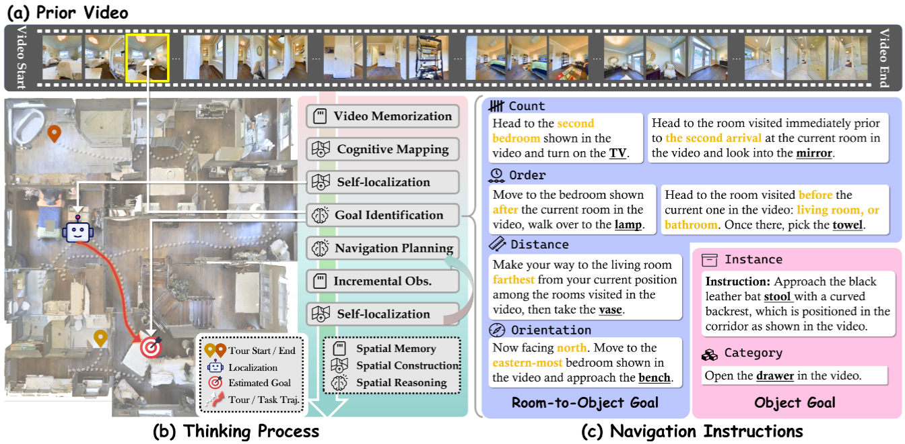

# VSI-NavBench

<div align="center">

<!-- [](https://0309hws.github.io/VL-LN.github.io/)
[](https://arxiv.org/abs/2512.22342)
[](https://huggingface.co/datasets/InternRobotics/VL-LN-Bench/tree/main/)
[](https://huggingface.co/InternRobotics/VL-LN-Bench-basemodel/tree/main) -->


</div>

Spatial intelligence is the core capability for MLLMs to perform real-world embodied interactions. Existing spatial intelligence benchmarks are restricted to static non-embodied paradigms, while mainstream navigation tasks fail to comprehensively evaluate full-stack spatial capabilities of MLLMs. To address this gap, we present VSI-NavBench, a novel video-contextualized <b>nav</b>igation <b>bench</b>mark for evaluating closed-loop <b>v</b>isual-<b>s</b>patial <b>i</b>ntelligence of MLLMs. Our benchmark takes videos of scenes as global visual-spatial context, with a two-tier evaluation system (i.e. goal identification and navigation) to hierarchically evaluate static and dynamic spatial capabilities. Built on Matterport3D, the benchmark comprises 1,500 episodes for evaluation and 100k for training. MV-DualVLN, which separates spatial intelligence with low-level control, is proposed as a strong baseline. Benchmarking experiments show that even the top closed-source MLLM achieves below 50% success rate on goal identification, with about 20% performance gap between goal identification and navigation, revealing challenges in both upstream spatial cognition and downstream embodied planning.

<div align="center">



</div>


## 🛠 Getting Started
We test under the following environment:
* Python 3.9
* Pytorch 2.4.1
* CUDA Version 11.8 

**Preparing  a conda env with `Python3.9` & Install habitat-sim and habitat-lab**
```bash
conda create -n vsinav python=3.9
conda install habitat-sim==0.2.5 withbullet headless -c conda-forge -c aihabitat
git clone --branch v0.2.5 https://github.com/facebookresearch/habitat-lab.git
cd habitat-lab
pip install -e habitat-lab  # install habitat_lab
pip install -e habitat-baselines # install habitat_baselines
```


## 🤖 Evaluation
```python
python run_eval_mvdualvln.py --cfg_file config/eval_mvdualvln.yaml
```


## 📄 License
<a rel="license" href="http://creativecommons.org/licenses/by-nc-sa/4.0/"></a>
<br />
This work is under the <a rel="license" href="http://creativecommons.org/licenses/by-nc-sa/4.0/">Creative Commons Attribution-NonCommercial-ShareAlike 4.0 International License</a>.
