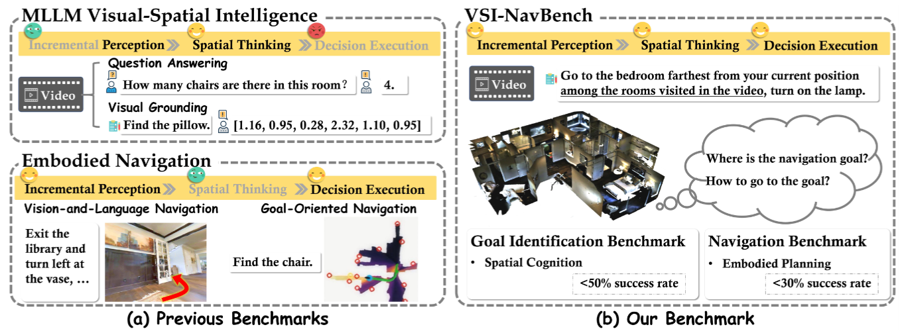

# VCN-Bench

<div align="center">

<!-- [](https://0309hws.github.io/VL-LN.github.io/)
[](https://arxiv.org/abs/2512.22342)
[](https://huggingface.co/datasets/InternRobotics/VL-LN-Bench/tree/main/)
[](https://huggingface.co/InternRobotics/VL-LN-Bench-basemodel/tree/main) -->


</div>

Spatial reasoning is fundamental to embodied agents, yet it remains unclear whether spatial understanding can be carried forward to guide sequential interactions.
Existing spatial-reasoning benchmarks typically terminate at offline predictions, while navigation benchmarks evaluate spatial reasoning as part of instruction following and exploration.
We introduce VCN-Bench, a <b>V</b>ideo-<b>C</b>ontextualized <b>N</b>avigation benchmark for probing closed-loop spatial reasoning over prior visual experience in MLLMs. Given a prior video covering both the initial location and destination, the agent is tasked with reasoning out the instruction-specified target and navigating toward it with the inferred spatial context. 
Built on Matterport3D, VCN-Bench contains five instruction types, 100k training episodes, and 1,250 evaluation episodes. Navigation serves as the primary evaluation, while diagnostic goal identification helps distinguish destination-resolution errors from subsequent navigation failures. 
We further propose MV-DualVLN, a planning-oriented baseline that jointly leverages prior video and in-episode observations. Experiments reveal limited navigation performance, a substantial destination-resolution-to-navigation gap, and frequent navigation failures even after correct destination identification.

<div align="center">


</div>


## 🛠 Getting Started
We test under the following environment:
* Python 3.9
* Pytorch 2.4.1
* CUDA Version 11.8 

**Preparing  a conda env with `Python3.9` & Install habitat-sim and habitat-lab**
```bash
conda create -n vcn python=3.9
conda install habitat-sim==0.2.5 withbullet headless -c conda-forge -c aihabitat
git clone --branch v0.2.5 https://github.com/facebookresearch/habitat-lab.git
cd habitat-lab
pip install -e habitat-lab  # install habitat_lab
pip install -e habitat-baselines # install habitat_baselines
```


## 📦 Training Data Collection
Set `mp3d_dir`, `file_path`, and `output_parent_dir` in `config/collect_data.yaml`, then collect navigation trajectories:
```bash
python run_collect_data.py --cfg_file config/collect_data.yaml
```

Project the chosen frontier or snapshot at each step to a pixel goal. `frontier_dir` is the episode folder produced above (`output_parent_dir/exp_name`):
```bash
python frontier_to_pixel.py \
  --cfg_file config/collect_data.yaml \
  --frontier_dir /your/path/to/collected/episodes \
  --instruction /your/path/to/instruction/instruction.json.gz \
  --output_dir /your/path/to/pixel/labels
```

If several repeats were collected into subfolders of one root, merge them into a single label file:
```bash
python frontier_to_pixel.py --merge --output_root /your/path/to/pixel/labels
```


## 🤖 Evaluation
**MV-DualVLN**
```bash
python run_eval_mvdualvln.py --cfg_file config/eval_mvdualvln.yaml
```

**Zero-shot 3D-Mem**

Set the scene, instruction, video, and detector checkpoints in `config/eval_3dmem.yaml`, then run:
```bash
python run_eval_3dmem.py --cfg_file config/eval_3dmem.yaml
```


## 📄 License
<a rel="license" href="http://creativecommons.org/licenses/by-nc-sa/4.0/"></a>
<br />
This work is under the <a rel="license" href="http://creativecommons.org/licenses/by-nc-sa/4.0/">Creative Commons Attribution-NonCommercial-ShareAlike 4.0 International License</a>.


## 🙏 Acknowledgement
The navigation pipeline is built upon [3D-Mem](https://github.com/UMass-Embodied-AGI/3D-Mem) (Yang et al., CVPR 2025). We thank the authors for releasing their code.
